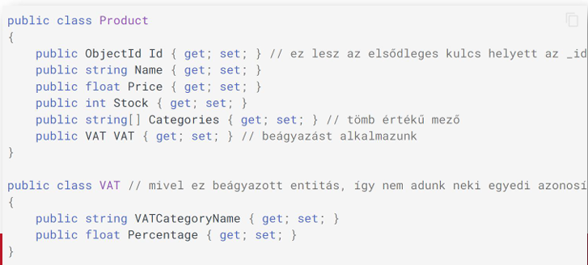

Természetesen, itt van a MongoDB-ről szóló diasor teljes, minden apró részletre kiterjedő és kommentárokkal ellátott magyarázata.

---

### Bevezetés és a NoSQL Motivációja (1-7. dia)

**1. dia: Címlap**
Az előadás címe: **"Adatvezérelt rendszerek: MongoDB"**. Ez a rész egy teljesen más típusú adatbázis-világba vezet be, a NoSQL adatbázisok univerzumába, a MongoDB-n keresztül, ami az egyik legnépszerűbb dokumentum-alapú adatbázis.

**3-6. dia: NoSQL: motiváció**
Miért van egyáltalán szükség a relációs (SQL) adatbázisokon túli megoldásokra?
*   **A probléma:** Ahogy egy alkalmazás fejlődik, az adatmodellje egyre bonyolultabbá válik. Egy egyszerű séma (3. dia) idővel egy átláthatatlan, sok-sok táblából álló pókhálóvá nőhet (4. dia), amiben a sok `JOIN` miatt a lekérdezések lassulnak.
*   **Relációs adatbázisok hátrányai (nagy rendszereknél):**
    1.  **Skálázhatóság:** A relációs adatbázisokat nehéz **horizontálisan skálázni**.
        *   *Vertikális skálázás (SQL):* Veszünk egy erősebb szervert (több RAM, gyorsabb CPU). Ez drága és vannak fizikai korlátai.
        *   *Horizontális skálázás (NoSQL):* Több olcsóbb szervert kapcsolunk össze egy fürtté (klaszterré). Ez a NoSQL rendszerek egyik fő erőssége.
    2.  **Merev adatmodell:** Az előre definiált, kötött séma (minden sornak ugyanazok az oszlopai) nehézkessé teszi a gyors fejlesztést és a változó adatstruktúrák kezelését.
    3.  **Magas rendelkezésre állás:** Egy elosztott, hibatűrő relációs adatbázis-klaszter felépítése és üzemeltetése rendkívül bonyolult és költséges.
*   **NoSQL:** A név félrevezető. Nem azt jelenti, hogy "NEM SQL", hanem inkább azt, hogy **"Not Only SQL"** (Nem csak SQL). Ezek az adatbázisok elhagyják a szigorú relációs modellt a nagyobb rugalmasságért és skálázhatóságért cserébe.

**7. dia: SQL vs. NoSQL – Főbb különbségek**

| Jellemző | SQL (Relációs) | NoSQL (pl. MongoDB) |
| :--- | :--- | :--- |
| **Modell** | Relációs (táblák, sorok) | Nem-relációs (dokumentumok, gráfok, stb.) |
| **Séma** | Előre definiált, merev | Dinamikus, rugalmas (sémamentes) |
| **Skálázás** | Vertikális ("scale-up") | Horizontális ("scale-out") |
| **Alap egység** | Tábla / Sor | Dokumentum (JSON/BSON) |
| **Konzisztencia** | Erős konzisztencia (ACID) | Végül is konzisztencia (BASE) |

---

### A MongoDB Felépítése és Alapfogalmai (8-16. dia)

**8. dia: Rendszerarchitektúra és Logikai felépítés**
*   **Architektúra:** A kliens (a mi alkalmazásunk) egy **driver** (meghajtóprogram) segítségével kommunikál a `mongod` szerverfolyamattal. A kommunikáció egy bináris, TCP/IP alapú protokollon ("wire protocol") keresztül történik, ahol a kérések és válaszok is JSON-szerű dokumentumok.
*   **Logikai hierarchia:**
    *   **Klaszter (Cluster):** Több szerver összessége.
    *   **Szerver (Server):** Egy fizikai vagy virtuális gép, amin a `mongod` fut.
    *   **Adatbázis (Database):** Gyűjtemények logikai csoportja.
    *   **Gyűjtemény (Collection):** Ez a relációs **tábla** megfelelője.
    *   **Dokumentum (Document):** Ez a relációs **sor** megfelelője.

**9-10. dia: A Dokumentum**
Ez a MongoDB lelke, az elemi tárolási egység.
*   **Formátum:** **BSON** (Binary JSON). Ez a JSON bináris, típusinformációkat is tartalmazó, hatékonyan tárolható és feldolgozható változata.
*   **Struktúra:** Kulcs-érték párok halmaza, mint egy JSON objektum. Az érték lehet egyszerű (szöveg, szám), vagy összetett (beágyazott objektum, tömb).
*   **`_id` kulcs:** Minden dokumentumnak **kötelezően** van egy `_id` nevű mezője, ami a dokumentum **elsődleges kulcsaként** funkcionál. Ha mi nem adunk meg értéket, a driver vagy a szerver automatikusan generál egy globálisan egyedi `ObjectId`-t.
*   **Méret limit:** Egyetlen dokumentum mérete nem haladhatja meg a **16 MB**-ot. Ez fontos tervezési szempont!

**11-12. dia: A Gyűjtemény (Collection)**
*   **Analógia:** A relációs adatbázis táblájának felel meg.
*   **Sémamentes (Schema-less):** Ez a legfontosabb tulajdonsága.
    *   Nem kell előre létrehozni, az első dokumentum beillesztésekor automatikusan létrejön.
    *   Egy gyűjteményen belül a dokumentumoknak **nem kell azonos struktúrával** rendelkezniük. Az egyik "felhasználó" dokumentumnak lehet `title` mezője, a másiknak nem, a harmadiknak pedig az `age` mezője lehet szám helyett szöveg.
*   Ez a rugalmasság rendkívül hasznos a fejlesztés korai szakaszában és gyorsan változó követelmények esetén.

**13-14. dia: Relációs séma vs. MongoDB**
Ez a dia összefoglalja a fogalmak megfeleltetését:
*   Tábla → **Gyűjtemény**
*   Rekord → **Dokumentum**
*   Oszlop → **Mező (Field)**
*   Kulcs → **`_id` / `ObjectId`**
*   Külső kulcs → **Hivatkozás** (manuálisan tárolt `_id` érték)
*   JOIN → **Nincs közvetlen megfelelője!** Helyette **beágyazást** vagy alkalmazás oldali lekérdezést (`$lookup`) használunk.
*   Tranzakciók → Korlátozottan, de léteznek.

**15-16. dia: Az alapértelmezett kulcs (`_id` és `ObjectId`)**
*   Az `_id` mező értéke egyedi kell, hogy legyen a gyűjteményen belül.
*   Az automatikusan generált `ObjectId` egy 12 bájtos érték, ami több részből tevődik össze, hogy nagy valószínűséggel globálisan is egyedi legyen:
    *   4 bájt: időbélyeg (másodperc pontossággal)
    *   5 bájt: a gép és a folyamat egyedi azonosítója
    *   3 bájt: egy számláló
*   Bár létrehozhatunk másik mezőt egyedi indexszel, a lekérdezések a `_id` mezőre a leggyorsabbak.

---

### MongoDB Séma Tervezés (17-25. dia)

A MongoDB-ben a séma tervezése a legnagyobb kihívás. A fő kérdés: **Hivatkozzunk vagy ágyazzunk be?**

**17. dia: Hivatkozás (Referencing / Normalization)**
*   **Ötlet:** A relációs adatbázisokhoz hasonlóan külön gyűjteményekben tároljuk az adatokat, és az egyik dokumentumban a másik `_id`-jával hivatkozunk.
*   **Példa:** A `user` dokumentum mellett van egy `contact` és egy `access` dokumentum, mindkettő tartalmaz egy `user_id` mezőt, ami a `user` `_id`-jára mutat.
*   **Mikor jó?**
    *   Ha a hivatkozott adatot sok helyről el kell érni és gyakran változik.
    *   Nagy mennyiségű adat esetén (pl. egy terméknek több ezer kommentje van).
    *   Több-a-többhöz kapcsolatoknál.
*   **Hátrány:** Az adatok "összegyűjtéséhez" több lekérdezésre van szükség az alkalmazás oldalon (vagy a `$lookup` operátorra).

**18. dia: Beágyazás (Embedding / Denormalization)**
*   **Ötlet:** A kapcsolódó adatokat egyetlen, nagy dokumentumba ágyazzuk be.
*   **Példa:** A `user` dokumentumon belül van egy `contact` és egy `access` al-dokumentum (beágyazott objektum).
*   **Mikor jó?**
    *   Ha az adatok logikailag szorosan összetartoznak és általában együtt kérdezzük le őket.
    *   Egy-az-egyhez vagy egy-a-néhányhoz kapcsolatoknál.
*   **Előny:** Rendkívül gyors olvasás, mert egyetlen lekérdezéssel minden szükséges adatot megkapunk.
*   **Hátrány:** Adatduplikációhoz vezethet, és vigyázni kell a 16MB-os dokumentum méretlimittel.

**19-23. dia: Tervezési minták és példák**
Az általános ökölszabály: **"Beágyazz, hacsak nincs jó okod hivatkozni."**
*   **`Customer` példa (21. dia):** Egy vevőnek van egy fő telephelye (`mainSite`), ami beágyazott objektumként szerepel. A többi telephelye (`sites`) egy beágyazott objektumokból álló tömb. Ez jó, mert a telephelyek a vevőhöz tartoznak.
*   **`Order` példa (22. dia):**
    *   A rendelés **hivatkozik** a vevőre (`customer: ObjectId(...)`), mert a vevő egy külön entitás, ami a rendeléstől függetlenül is létezik és változhat.
    *   A rendelt termékek (`items`) **beágyazott** tömbként szerepelnek, de **denormalizált** adatokkal (pl. ár). A termék aktuális árát belemásoljuk a rendelésbe, hogy a rendelés a létrehozás pillanatában érvényes árat tükrözze, még ha a termék ára később változik is.
*   **`Product` példa (23. dia):** A szállítási információk beágyazva szerepelnek a termék dokumentumban.

---

### Tranzakciók és Konzisztencia (24-33. dia)

**24. dia: Elosztott ACID tranzakciók**
A MongoDB a 4.2-es verzió óta támogatja a több dokumentumra és több gyűjteményre kiterjedő, elosztott ACID tranzakciókat.
*   **Fontos:** Bár ez a funkció létezik, **használata jelentősen rontja a teljesítményt**. A MongoDB alapvetően nem erre lett kitalálva. A séma tervezésénél törekedni kell arra, hogy a tranzakciókat igénylő műveletek egyetlen dokumentumon belüli atomi műveletekké váljanak. Tranzakciókat csak végszükség esetén használjunk!

**26-29. dia: CAP-tétel és Konzisztencia modellek**
Ez a rész ismétli a korábban tanultakat, de most a NoSQL kontextusában.
*   **SQL (Tipikusan):** Az **ACID** modellt követi, ami az erős konzisztenciát helyezi előtérbe.
*   **NoSQL (Tipikusan):** A **BASE** modellt követi:
    *   **B**asically **A**vailable: A rendszer alapvetően mindig elérhető.
    *   **S**oft State: A rendszer állapota idővel változhat.
    *   **E**ventual Consistency: A rendszer "végül" konzisztens állapotba kerül.
*   Ez a gyakorlatban azt jelenti, hogy a NoSQL rendszerek a **rendelkezésre állást (Availability)** priorizálják a **konzisztenciával (Consistency)** szemben.

**30. dia: Tranzakciók MongoDB-ben**
*   **Egyetlen dokumentum frissítése mindig atomi!** Ez a MongoDB "beépített" tranzakciója. Ha egy művelet csak egy dokumentumot érint (pl. egy számláló növelése és egy állapot átírása), az mindig konzisztens lesz.
*   **Elosztott tranzakciók:** Lehetségesek, de lassúak.
*   **Read/Write Concerns:** Az izolációs szintek helyett a MongoDB "concern"-öket használ, amivel finomhangolható, hogy egy írási vagy olvasási művelet a klaszter hány csomópontjának megerősítésére várjon a sikerességhez.

**32. dia: MongoDB Protokoll és Driverek**
A MongoDB-hez minden népszerű programozási nyelvhez létezik hivatalos vagy közösségi driver, ami egy magas szintű, nyelvhez illeszkedő API-t biztosít a "nyers" JSON-alapú lekérdezések helyett. .NET alatt ez a `MongoDB.Driver`.

---

### MongoDB .NET Driver a Gyakorlatban (34-48. dia)

**35-36. dia: Kód - Adatbázis leképezés (Code First)**
Hasonlóan az EF Code First-höz, itt is C# osztályokkal (POCO) modellezzük a dokumentumainkat.



**37-39. dia: Lekérdezések**
A .NET driverrel kétféleképpen kérdezhetünk le:
1.  **Lambda kifejezésekkel (LINQ-szerűen):** Ez a javasolt, típus-biztos módszer. A driver lefordítja a lambda kifejezést a MongoDB saját lekérdező nyelvére.

    ```csharp
    // A 'products' nevű collection lekérése.
    var collection = db.GetCollection<Product>("products");

    // Olyan termékek keresése, ahol az ár kisebb, mint 123 ÉS a név tartalmazza a "red" szót.
    var results = collection.Find(x => x.Price < 123 && x.Name.Contains("red")).ToList();
    ```

2.  **Builder API-val:** Típus-biztos, de "bőbeszédűbb" módszer, ahol a szűrőket objektumokként építjük fel.

**38. dia: Operátorok**
A LINQ provider sok operátort támogat: szűrés, null ellenőrzés, tömbökben való keresés (`AnyEq`), rendezés (`Sort`), lapozás (`Skip`, `Limit`).

**40-42. dia: Aggregációs Csővezeték (Aggregation Pipeline)**
Ez a MongoDB `GROUP BY` és `JOIN` megfelelője. Lehetővé teszi több dokumentum szerver oldali feldolgozását egy "csővezetéken" keresztül, ami több lépésből áll (pl. szűrés (`$match`), csoportosítás (`$group`), projekció (`$project`)).
*   A `$lookup` a pipeline egyik lépése, ami egy `LEFT OUTER JOIN`-szerű műveletet valósít meg. **Használatát érdemes megfontolni**, mert ha sokat használjuk, az azt jelezheti, hogy a séma tervezése nem optimális, és talán egy relációs adatbázis jobb választás lenne.

**43-48. dia: CRUD Műveletek a .NET Driverrel**
*   **Beszúrás:** `collection.InsertOne(newProduct);` vagy `InsertMany(...)`
*   **Törlés:** `collection.DeleteOne(x => x.Id == ...);` vagy `DeleteMany(...)`
*   **Teljes csere:** `collection.ReplaceOne(filter, replacementDocument);`
*   **Mezők módosítása (Update):** `collection.UpdateOne(filter, updateDefinition);` Itt a `Builders<T>.Update` segítségével atomi operátorokat használhatunk (`Set`, `Inc` - növelés, `Push` - elem hozzáadása tömbhöz, `Unset` - mező törlése stb.).
*   **Upsert (Update or Insert):** Ha a `ReplaceOne` vagy `UpdateOne` műveletnek `IsUpsert = true` opciót adunk, akkor ha a szűrő nem talál egyező dokumentumot, létrehoz egy újat a megadott adatokkal.