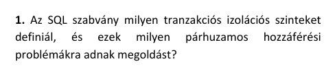
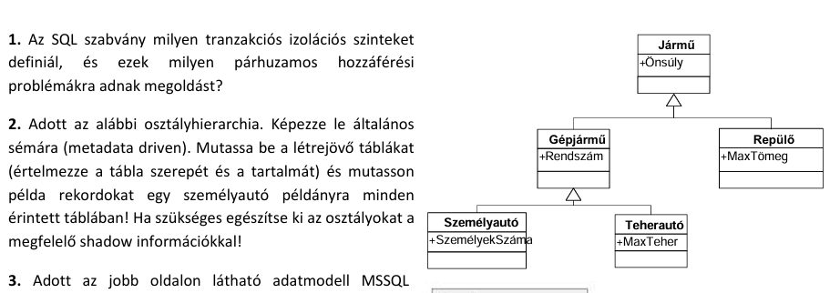
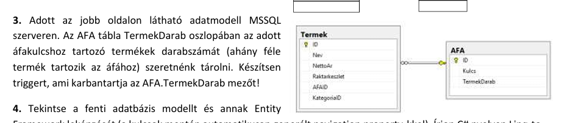
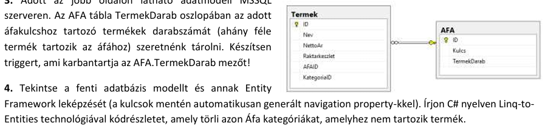
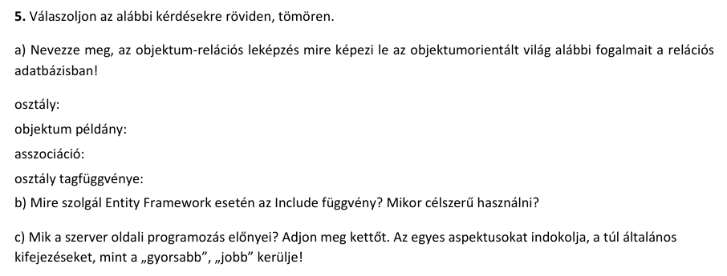
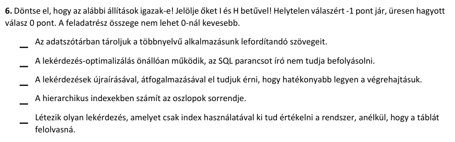

# 1.


 - read uncommitted: semmi elől nem véd
 - read committed: dirty read ellen véd
 - repeatable read: nem ismételhető olvasás ellen is véd, általában lost update től is
 - serializable: minden ellen véd (phantom olvasás tol is)
 
 # 2.
 


- Class
	- ClassID
	- Name
	
- Attribute
	- ClassID
	- AttributeID
	- Name
	
- Inheritance
	- ParentClassID
	- ChildClassID
	
- Value
	- InstanceID
	- AttributeID
	- Value

- Class
	- 1  |  Jarmu
	- 2  |  Gepjarmu
	- 3  |  Szemelyauto
	- 4  |  Teherauto
	- 5  |  Repulo

- Attribute
	- 1  |  101  |  Onsuly
	- 2  |  102  |  Rendszam
	- 3  |  103  |  Szemelyekszama
	- 4  |  104  |  Maxteher
	- 5  |  105  |  Maxtomeg

- Inheritance
	- 1  |  2
	- 1  |  5
	- 2  |  3
	- 2  |  4

1300kg, ASD-123, 5 szemelyes auto, 99es ID

- Value
	- 99 |  101  |  1300
	- 99 |  102  |  "ASD-123"
	- 99 |  103  |  5

# 3.
 


```sql

create trigger vatcounter
on Termek
for insert, delete, update
as

	update AFA
	set AFA.TermekDarab = (select count(*) from Termek where AFA.ID = Termek.AFAID)
	where AFA.ID in (select inserted.AFAID from inserted union select deleted.AFAID from deleted)

end
```

# 4.
 


var todelete = db.AFA.Where(x => !x.Termekek.Any());<br>
db.RemoveRange(todelete); <br>
db.SaveChanges();


# 5.
 
## a)
osztály -> tábla<br>
objektum példány -> rekord<br>
asszociáció -> kulcs hivatkozás? (javitas: foreign key) <br>
osztály tagfüggvénye -> nem képzi le <br>

## b)
Az include függvény az eagerloadingot segíti elő. Akkor célszerű használni, amikor
a lekérdezett táblának (pl Blog) később a referenciáit (pl Posts) is le akarjuk
később kérdezni; az eagerloading egy lekérdezésbe rakja a a kettőt
(Blog.Include(x => x.Posts))

## c)
Nagyobb biztonság: szerver oldalon való számolás/lekérdezések készítése és futtatása
nagyobb biztonságot nyújt, mintha közvetlenül a kliens oldalon levő input mezőt
adnánk tovább minimális formázással az adatbázisnak.<br>

Atomicitás: Szerver oldalon nagyobb számolásokat lehet egy tranzakcióba kezelni,
így elkerülhetjük a versenyhelyzeteket. (pl egy tárolt eljárásba kezelünk valamit)

 
# 6.

H, H, I, I, I